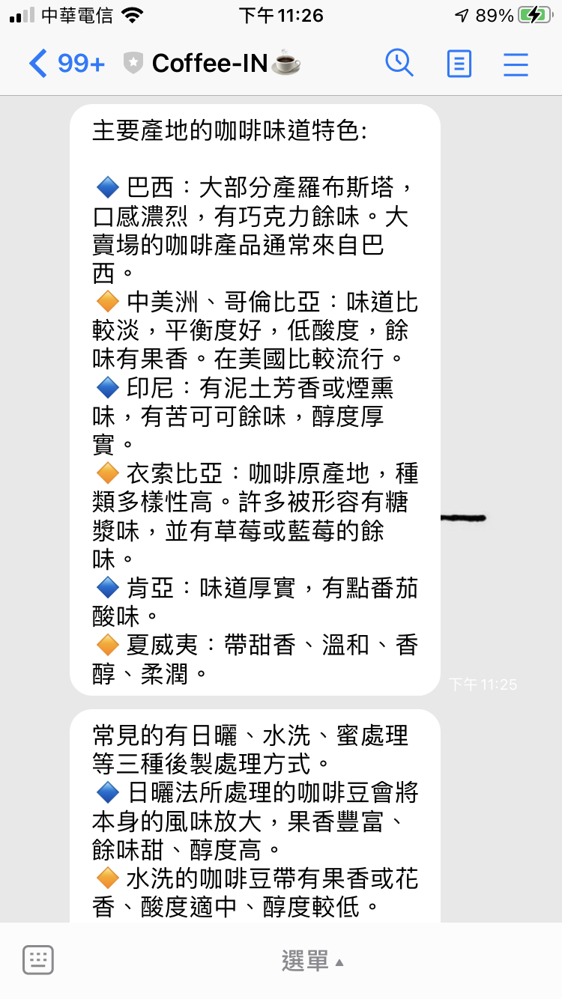

# Coffee-IN☕ line機器人 
## 咖啡廳? Coffee-IN☕! 
 大台北地區咖啡廳走透透  
  
- <a href="#line加好友">line加好友</a>  
- <a href="#使用介紹">使用介紹</a>  
- <a href="#API資訊">API資訊</a>
## line加好友
- Line ID: **@287fdpvn**  

- 掃描下方 QR code  
  
- 加入好友畫面  

___
## 使用介紹
### 點選下方選單'使用介紹'  

  
1. 查詢咖啡店，傳送「!name 咖啡廳店名」，機器人將會快速答覆店家位置及資訊。

  
2. 輸入「不限時」，機器人將答覆您 8 家大台北地區用餐不限時間的咖啡廳。

  
3. 傳送 「位置資訊」，即可查詢距離您 5 公里處的 5 家咖啡廳。

 

  
4. 點選選單「烘焙小知識」

  
  
5. 點選「咖啡豆小知識」

  
6. 點選「Metro Taipei」，連結外部台北捷運站路線圖

___
## API資訊
- 使用 <a href="https://cafenomad.tw/developers/docs/v1.2">Cafe Nomad API</a>  
    

  
  

<a href="#咖啡廳? Coffee-IN☕!">回到 Coffee-IN☕</a>   
<a href="#">To Top</a>
  
  
  

